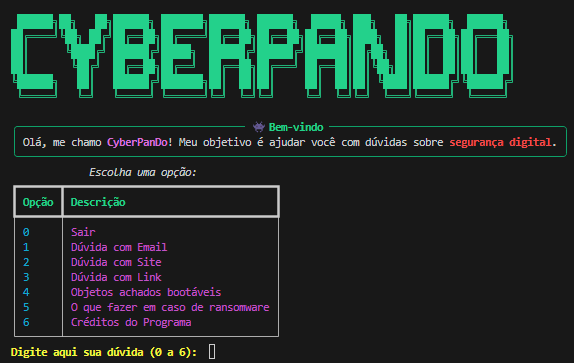

# CyberPando 🛡

## Índice
- [Descrição](#descrição)
- [Motivação](#motivação)
- [Funcionalidades](#funcionalidades)
- [Tecnologias Utilizadas](#tecnologias-utilizadas)
- [Instalação](#instalação)
- [Como Usar](#como-usar)
- [Exemplo de Uso](#exemplo-de-uso)
- [Estrutura do Código](#estrutura-do-código)
- [Contribuição](#contribuição)
- [Licença](#licença)
- [Autores](#autores)
- [Agradecimentos](#agradecimentos)
- [Prints](#prints)

---

## 🔍Descrição
O **CyberPando** é uma ferramenta interativa desenvolvida para auxiliar funcionários a identificar e resolver questões relacionadas à segurança digital dentro do ambiente corporativo.

Ele oferece suporte para identificar links suspeitos, analisar e-mails, reconhecer dispositivos bootáveis desconhecidos e reagir adequadamente a ataques de ransomware. Utilizando uma interface visual no terminal, o projeto foi criado com o propósito de promover decisões mais seguras e informadas em situações de risco digital.

O projeto foi criado em **11 de maio de 2025**, com atualizações planejadas para torná-lo um aplicativo multiplataforma, visando reduzir incidentes de segurança digital no ambiente corporativo e aumentar a capacitação e a autonomia dos colaboradores.

---

## Motivação
Eu e **Douglas Nunes** criamos este repositório com o objetivo de disponibilizar uma ferramenta prática e acessível para aumentar a consciência sobre segurança digital nas empresas. Ao identificar ameaças digitais e oferecer orientações sobre como reagir, o **CyberPando** busca contribuir para um ambiente de trabalho mais seguro e resiliente contra ciberataques.

---

## Funcionalidades
- 📧 **Análise de E-mails**: Verifica a segurança de e-mails suspeitos.
- 🌐 **Verificação de Sites**: Garante que o site visitado seja seguro e legítimo.
- 🔗 **Análise de Links**: Realiza verificação de links encurtados ou desconhecidos.
- 💾 **Dispositivos Bootáveis**: Alerta sobre o risco de conectar dispositivos externos desconhecidos.
- 🛡 **Orientações sobre Ransomware**: Instruções práticas sobre o que fazer caso o sistema esteja infectado.
- 💡 **Interface Interativa via Terminal**: Experiência visual aprimorada usando a biblioteca **Rich**.

### Futuras Funcionalidades
- 📱 **Aplicativo Multiplataforma**: Tornar a ferramenta disponível para dispositivos móveis.
- 🌍 **Suporte Multilíngue**: Facilitar o uso global da ferramenta.
- 🔄 **Análise de Riscos Automática**: Monitorar eventos suspeitos em tempo real.

---

## ⚙️Tecnologias Utilizadas
- **Python 3**: Linguagem de programação principal.
- **Rich**: Criação de interfaces ricas no terminal.
- **Requests**: Realizar requisições HTTP.
- **Socket**: Obtenção de informações de IP.
- **OS**: Limpeza da tela e integração com o sistema operacional.

---

## 🚀Instalação
1. **Clonar o repositório:**
   bash
   git clone https://github.com/username/CyberPando.git
   cd CyberPando
   

2. **Instalar dependências:**
   bash
   pip install -r requirements.txt
   

3. **Executar o programa:**
   bash
   python cyberpando.py
   

---

## Como Usar
Após iniciar o programa, escolha uma opção no menu principal para obter orientações sobre segurança digital.

### Exemplos:
- **Dúvida com Link:**
    - Insira um link suspeito.
    - O programa verifica a acessibilidade e apresenta informações sobre o IP.
- **Objetos Bootáveis:**
    - Receba um alerta sobre dispositivos USB encontrados na rua.
- **Ataque de Ransomware:**
    - Siga os passos recomendados para mitigar danos e proteger seus arquivos.

---

## 💡 Exemplo de Uso
bash
Digite aqui sua dúvida (0 a 6): 3
Digite o link que deseja verificar: https://example.com

🔗 Resultado da Verificação
Link https://example.com está acessível!
IP: 93.184.216.34
Informações do IP: {'IP': '93.184.216.34', 'Cidade': 'Los Angeles', 'Região': 'California', 'País': 'United States', 'Organização': 'Example Inc.', 'ISP': 'Example ISP', 'Latitude': 34.0522, 'Longitude': -118.2437}
Nunca clique em links encurtados ou estranhos sem antes verificar com uma ferramenta como virustotal.com.


---

## Estrutura do Código
```
CyberPando/
├── cyberpando.py        # Arquivo principal
├── README.md            # Documentação do projeto
├── requirements.txt     # Dependências do projeto
└── LICENSE              # Licença de uso
```

---

## Contribuição
Contribuições são bem-vindas! Siga os passos para colaborar:

1. Faça um fork do projeto.
2. Crie uma branch para sua funcionalidade/correção:
   bash
   git checkout -b minha-funcionalidade
   
3. Commit suas alterações:
   bash
   git commit -m "Adiciona nova funcionalidade"
   
4. Envie suas alterações:
   bash
   git push origin minha-funcionalidade
   
5. Crie um Pull Request no repositório original.

---

## 📌Licença
Este projeto está licenciado sob a licença MIT. Veja o arquivo [LICENSE](LICENSE) para mais detalhes.

---

## 🧑‍💻Autores
- **Douglas Nunes**: [GitHub](https://github.com/NunesGunnar) | [LinkedIn](https://www.linkedin.com/in/douglas-nunes-0176672a0/)
- **Athos Dã**: [GitHub](https://github.com/panda12332145) | [LinkedIn](https://www.linkedin.com/in/athos-d%C3%A3-boanergis-5585a4288/)

---

## Agradecimentos
Agradecemos a todos que contribuíram para o desenvolvimento deste projeto. Qualquer feedback ou sugestão é bem-vinda!

---

## Prints


